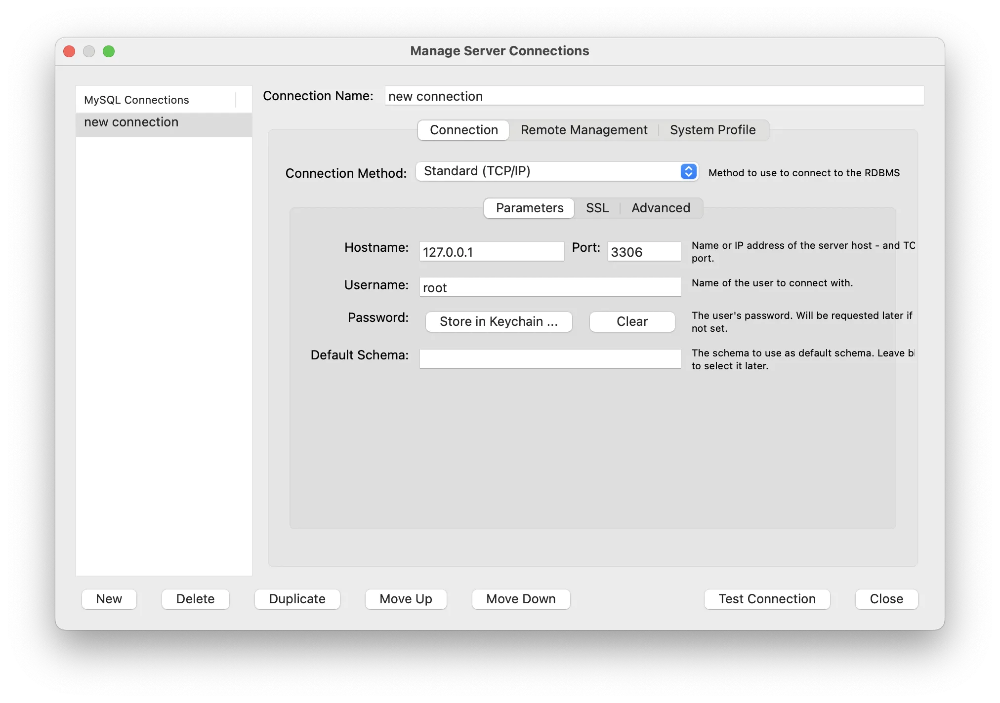

# Entorn de desenvolupament

## Programari

- [Visual Studio Code](https://code.visualstudio.com/)
- [Docker Desktop](https://www.docker.com/get-started/)
- [MySQL Workbench](https://dev.mysql.com/downloads/workbench/)

## Depuració a Mac

Per iniciar la depuració del fitxer `index.php` amb VS Code:
1. Obrir l'aplicació `Docker Desktop` si no s'ha obert abans per iniciar el dimoni
2. Obrir l'aplicació `Visual Studio Code`:
   1. Obrir la carpeta on es trobin aquests fitxers
   2. Iniciar la composició: fer clic al fitxer `docker-compose.yml` i seleccionar `Compose Up`
   3. Obrir el fitxer `index.php` i afegir algun breakpoint
   4. Iniciar la depuració: `Run and Debug`, `Listen for Xdebug`
3. Obrir un exercici al navegador web preferit

| Exercici      | Descripció    |
| ------------- | ------------- |
| http://localhost:8080/001/ | Crida a `phpinfo();` |
| http://localhost:8080/002/ | Ús de variables |
| http://localhost:8080/003/ | Connexió i execució de consultes a una base de dades mysql |
| http://localhost:8080/004/ | Exemple d’ús de les classes TComptador i TComptaSalt |
| http://localhost:8080/005/AltaEstudiants.html | Exemple MVC |
| http://localhost:8080/006/ | Formulari: enviament de dades amb el mètode GET |
| http://localhost:8080/007/ | Formulari: enviament de dades amb el mètode POST |
| http://localhost:8080/008/ | Formulari: diversos grups de botons de tipus `radio` |
| http://localhost:8080/009/ | Formulari: comentaris amb `textarea` |
| http://localhost:8080/010/ | Formulari: llista desplegable |
| http://localhost:8080/011/ | Formulari: llista desplegable amb selecció múltiple |
| http://localhost:8080/012/ | Formulari: llista desplegable amb opcions agrupades i ús de la funció PHP `isset` |

## MySQL Workbench

Crear una connexió nova:
1. Des del menú superior, seleccionar `Database`, `Manage Connections...`
2. Fer clic al botó `New`
3. Introduir els paràmetres de la connexió:

